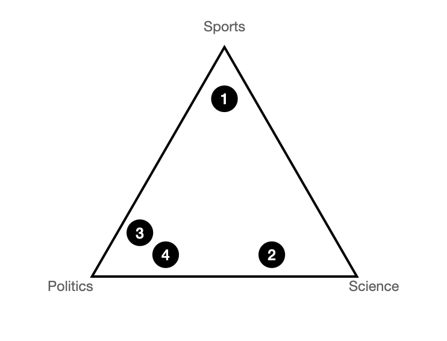
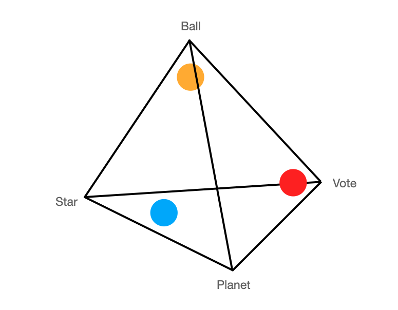
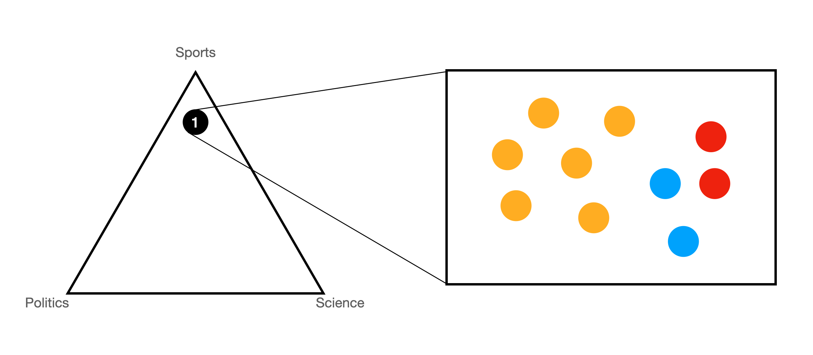
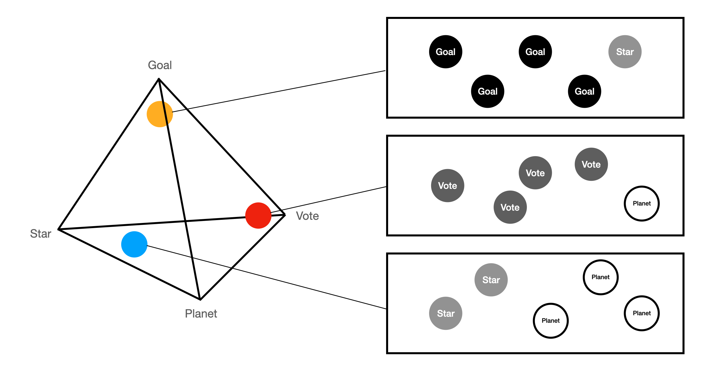

# What is LDA?
It's easy to read a document and know what it's about. In fact, it's almost trivial. But imagine you have thousands of documents. No, imagine you have millions of documents, and you want to know organize those documents into topics. Certainly the best way wouldn't be to read every single document and sort it into topics would it?

I think you can gather by the tone of my writing (as well as the fact that this a data science tutorial) that doing that would not the best way. It would be far better to use a machine learning method like topic modeling. 

Specifically, what we will be learning is **Latent Dirichlet Allocation** or LDA for short. Before we dive into how the model works, we are going to cover it briefly at a high level. First, we will cover some of the more disappointing limitations of LDA. LDA will sort your documents into a given number of topics, but you have to provide the number of topics to sort into. So you cannot simply give the model a corpus of one million documents and then have it divide it into the "correct" number of topics. Instead you will say, here are one million documents. Please divide this into three groups. 

Second, LDA won't label the topics for you. So once you have those million documents divided into three groups, it won't be labeled as "science", "sports", and "politics". However, LDA will provide the words most associated with that topic, and from that you can determine what that topic is about. 

Finally, keep in mind that LDA is a mixed membership model. This means that a document will be classified as belonging *mostly* to a particular topic. So for example, a given document might be classified as 90 percent about Topic A, 7 percent about Topic B, and 3 percent about Topic C. 

So now you know the limitations and advantages of LDA. But how exactly does it work? First, we will provide an intuitive explanation of model, and then we will show you had to code an example.

## The Documents

Let's imagine we have four documents (in this cases sentences) that we want to sort into three topics, science, sports, and politics.  Yes, I know these aren't normal documents, but we are trying to keep it simple.

1. goal goal goal planet vote
2. Vote planet planet vote vote 
3. Planet planet star planet goal
4. Planet star vote planet goal

A good way to assign a topic to each sentence would be to see what percentage of each sentence is made of a word that belongs to a given topic. 

So for example, the first sentence is mostly made up of the word goal, so we will place that into the sports category. The second sentence is mostly made up of the word vote, so we will place it in the politics topic, though only barely because it has the word planet twice as well. The last two are mostly related to science, so we put those in the science topic. 

In LDA, we won't place the sentences exclusively in one topic. Instead we will put them partially in each topic, depending on the composition of the sentence. We will use something called a dirichlet distribution to do this.

## Document-Topic Dirichlet Distribution

Let's take a second to explain what a Dirichlet distribution is. Imagine you have a three cornered room where you a throwing a party for your documents. In one corner, you put out snacks for sports fans, in another you put out lab equipment for science freaks, and in the final quarter you put out a newspaper for politics junkies. Depending what a document is about, it will be attracted to one or more of the corners.


If a document was one hundred percent about politics, it would stand in the corner with the newspaper. If a sentence was fifty percent about politics and fifty percent about science it would stand in the middle of between the science corner and the politics corner. If a sentence was evenly about all three, it would stand in the center. And so on and so on. 

Essentially the corners are the topics and the points inside the triangle are the documents.

Let's see where our four documents would end up. Keep in mind that this is totally at your discretion. In fact, the algorithm will actually be doing it randomly, but more on that later. 

<div class = 'center' style = 'width: 80%'>

</div>

As you can see, since the first document is mostly about sports, its mostly in the sports corner. The second document is mostly about science with some politics sprinkled in, so it's between the science and politics corner.

### Word-Topic Dirichlet Distribution 

Next we are going to create a dirichlet distribution where the corners are the words and the points are the topics. Because we have *four words*, we are going to use a *four point simplex*. This is also the maximum number of points I can represent graphically (funny how that works out).

This works the same way as the previous example. The more attracted a topic is to a word, the closer it will go to that corner. If it's pulled to multiple corners, it will end up somewhere in the middle. 

Looking at the four corners of the simplex where would you put the politics topic? Probably pretty close to "vote" right?



The orange ball represents the "Sports" topic, so we put it close to the "Goal" corner. The red ball represents "Politics", so we put it  close to the "Vote" corner. The blue ball represents "science", so we put it between the "Star" and "Planet" corners. 

## Generating Articles 

We are going to use the two distributions we just created to generate four new articles. After that, we will then see how closely those articles match to our original articles to decide how well our model worked. 

To create the articles, we are going to generate a series of topics, which in turn we will use to generate a series of words. The generated topics will come from each point in our document-topic distributions. 

This is all getting a bit abstract. Lets look at an example. 

Look at the first document. It is 60 percent about sports, 20 percent about science, and 20 percent about politics. Now imagine a box with ten balls inside.  Six of those balls (the orange ones) will represent sports. Two balls (the blue ones) will represent science, and two balls (the red ones) will represent politics. 



Since we are trying to create a sentence with five words, we are going to pick out five balls from this box. Because there is an element of chance, let's say we pick out these five topics:

1. Sports
2. Science
3. Sports
4. Sports
5. Science

Now using the distributions from our word-topic simplex, we are going to assign a word to each topic that we just generated.  

Remember, where you placed the topic within the word simplex will determine the mixture of words in that topic. The algorithm will place the topic randomly (again, more on that later), but for now, let's assume that we placed the topics like you see below. 

Again, for each topic, imagine a box filled with balls but with each ball representing a word instead of a topic this time. For example, the science topic could contain 40 percent balls that represent star and 60 percent balls that represent planet. 



For each topic, we will draw out a ball giving us a word.

1. Goal
2. Planet
3. Goal
4. Goal
5. Planet

We have now generated one document. We will repeat this process again another four times (or until we have as many documents as we had in our original corpus). Finally, we will compare our generated corpus to our real corpus and see how closely the generated documents match the real ones. 

## Now for the Machine Learning

Now let's return to how the algorithm places the documents and topics randomly in each Dirichlet distribution.  

Your computer doesn't know where to place the documents in the document-topic distribution. So it guesses. It may guess that the word ball is related to the topic politics (which it will just know as Topic A), and that the politics topic should mostly contain words like planet and star. 

When it makes wrong guesses, it will create documents that are very different from the original set. The model will guess again and again. In the end, it use the distributions that produce a corpus of documents most resembling the original documents. 

From this, we will get two things: a dirichlet distribution of documents associated with topics and a dirichlet distribution of words associated with topics. We can use the word-topic distribution to deduce what that topic is about, and we can use the document-topic distribution to do what we set out to do, categorize documents into topics!

# LDA in R

If you didn't understand everything above, here's a secret. You can still perform LDA in R. In fact, I would venture that most people who do topic modeling do not have a good grasp of the concepts behind what they are doing. Yet, the world still turns. However, we are looking to be good data scientists, so we will both understand the concepts and know the code.

Before much coding can occur though, we will need data. Let's use getwiki() to get some. 

```{r, message=F, warning=F, error = F}

library(getwiki)
library(tidytext)
library(dplyr)
library(topicmodels)
library(ggplot2)
library(kableExtra)

data = get_wiki(c("virginia", "utah", "regression", "statistics", "latent dirichlet allocation", "claude monet", "Pierre-Auguste Renoir"))

```

Now that we have the data, we will do the normal prepartion steps. In addition, we are going to get a count of how often a given word appears.

```{r, message=F, warning=F, error = F}

data_tokenized = data %>% 
  unnest_tokens(word, content)%>%
  anti_join(stop_words)%>%
  count(titles,word,sort=TRUE) %>%
  ungroup()

```

Using cast_dtm, we can convert our dataframe into a document term matrix (DTM), which is the format we will need in order to create an LDA topic model. Recall that a DTM is a matrix that contains documents and terms as dimensions. 

```{r, message=F, warning=F, error = F}
data_dtm = data_tokenized %>%
  cast_dtm(titles, word ,n)

data_dtm
```

Next we are going to perform the actual LDA.

```{r, message=F, warning=F, error = F}

data_lda = LDA(data_dtm, k = 3, control = list(seed = 1234))

```

## Interpreting the Word Topic Distribution

Most likely, if you are performing LDA, you don't really know what is in the documents that you are analyzing. So step one will be to see which words are mostly strongly associated with which topics. Once you have that, you can get a good idea of what that topic is about. And once you know what a topic is about, you can then look at how each document is classified (and have it mean something). 

We are going to use the `tidy()` function to simplify the results. Remember the topic-word distribution from before? In R, we call this a beta matrix. The beta matrix tells us how closely a given word is associated with a given topic. We are going to find the top 10 most strongly associated words with each topic. We can use these results to determine what that topic is about. 

```{r, message=F, warning=F, error = F}
word_topics <- tidy(data_lda, matrix = "beta")

top_terms <- word_topics %>%
  group_by(topic) %>%
  top_n(10, beta) %>%
  ungroup() %>%
  arrange(topic, -beta)
```

Next we will use ggplot to make this a little easier to read. 

```{r, message=F, warning=F, error = F}

top_terms%>%
  mutate(term = reorder_within(term, beta, topic)) %>%
  ggplot()+
  geom_col(aes(term, beta, fill=topic), show.legend = FALSE)+
  labs(x = NULL, y = "tf-idf") +
  facet_wrap(~topic, ncol = 2, scales = "free") +
  coord_flip()+
  scale_x_reordered() +
  theme_classic()

```

You can see the first topic appears to be about math, the second appears to be a mix of Utah and the French impressionists, and the final topic is about Virginia. Ideally, the third group would have had a good mix of words from the Virginia article and the Utah article and the second would have just be the painters, but you can't have everything.

## Interpreting the Document Topic Distribution

Once you know what the topics are about, you will want to know which documents belong to which topic. 

Using the `tidy()` function, we can find our document-topic distribution. In R, this is called the "gamma" matrix. Because we have seven documents to categorize, we are going to look the top seven topics that the model associated with documents.

```{r, message=F, warning=F, error = F}
doc_topics <- tidy(data_lda, matrix = "gamma")

doc_topics %>%
  arrange(desc(gamma))%>%
  slice(1:7)%>%
  arrange(topic)%>%
  kable()%>%
  kable_styling("striped")

```

Interestingly, you can see that the model did a pretty good job organizing the documents. It did put Utah in with the impressionist painters, but it is a beautiful state, so we will let it slide.


