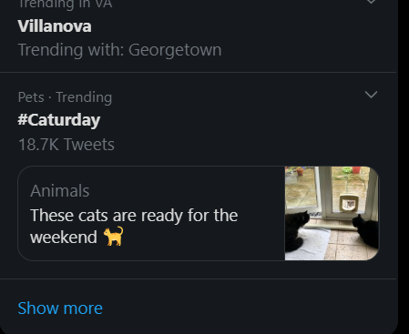

```{r, include=F}

source("../keys.R")

```

```{r setup, include=FALSE}
knitr::opts_chunk$set(echo = TRUE)
```

## Getting Started

### Getting a Developer Account
caitlin -  youtube video

### Saving Credentials in a .gitignore
After finally getting your credentials, you need to protect them. If you are just working locally on your computer, this is easy. Just do whatever you usually do to protect complicated passwords. However, if you are working on a git project (like this one), then you need to do something extra.

Luckily, the process is very simple. (1) Save your credentials in a different script and (2) add that script into your .gitignore, and then (3) add that script into the .gitignore. 

**Save your credentials into a script called keys.R**
```{}
# twitter
twitter_api_key = "sample_key"
twitter_api_secret_key = "sample_key"
twitter_access_token = "sample_key"
twitter_access_token_secret = "sample_key"

```

**Create a .gitignore file**

This part is a little more complicated than you may expect because you are just creating a file. But I think the most reproducible way is through git bash. In the root directory of your project, open up bash (right click and press "Git Bash Here"), and write the following code:

`touch .gitignore`

**Add script into your .gitignore and then call it into your project**
Just open up the .gitignore (notepad works fine), and add keys.R into the .gitignore file. Now if you are simply just writing `keys.R` into the file, than it has to be in the same directory. There are a bunch of different options for [.gitignore](https://www.atlassian.com/git/tutorials/saving-changes/gitignore). Finally, make sure that you call the keys script into your project so that the keys are in your environment. 

## rtweet

`rtweet` is a [package](rtweet.info) designed to interact with twitter's API. It is tidyverse ready meaning that its API calls return a data.frame. This is really convienient if your workflow includes things like `dplyr` or `tidytext`.

### Retrieving Topics
caitlin

### User Data
caitlin

### Posting a tweet
Corydon


[How to create a Twitter Developer Account](https://www.extly.com/docs/autotweetng_joocial/tutorials/how-to-auto-post-from-joomla-to-twitter/apply-for-a-twitter-developer-account/#apply-for-a-developer-account)


### Saving Credentials in a .gitignore


## TwitteR

TwitteR is a package providing access to Twitter's API, "with a bias towards API calls that are more useful in data analysis as opposed to daily interaction," according to [rdocumentation.org](https://www.rdocumentation.org/packages/twitteR/versions/1.1.9). It supports a number of functions, including retrieving trends and tweets with users' handles.  

### Retrieving Topics

To retrieve a trending topic, you can start by going to Twitter to see what matters to the world: 



It appears people like cats for some reason. No matter -- let's see if we can retrieve the last 500 tweets with the trending "#Caturday" hashtag.

First, call the twitteR package and run the `setup_twitter_oauth` function, which will set up your credentials for the twitteR session.

```{r, message=F, warning=F}
library(twitteR)
setup_twitter_oauth(twitter_api_key, twitter_api_secret_key,
                     twitter_access_token, twitter_access_token_secret)
```

Notice the keys and tokens in the `setup_twitter_oauth` function above. I've already read these keys into variables saved in the global environment. 

Next, create an object to store the string you want to search, set the number of tweets you wish to pull, and run the `searchTwitter` function. Notice you can set the "lang" argument to search for tweets in specific languages. I set lang equal to "en" for tweets in English.  

```{r, message=F, warning=F}
catweets <- searchTwitter('#Caturday', n = 10, lang='en')
```

Finally, put the retrieved tweets into a dataframe.

```{r, message=F, warning=F}
df <- do.call("rbind", lapply(catweets, as.data.frame))

library(kableExtra)

kable(df[1:2,1:2], format = "html")%>%
  kable_styling("striped")
```

### User Tweets

You can also retrieve tweets containing a user's handle. Let's see what the esteemed Gordon Ramsay is up to.


First, let's run the `searchTwitter` function for 100 tweets with the handle "@GordonRamsay".

```{r, message=F, warning=F}
tweets_gordon <- searchTwitter('@GordonRamsay', n = 100)
```

Then, let's get the text from those tweets.

```{r, message=F, warning=F}
feed_gordon = plyr::laply(tweets_gordon, function(t) t$getText())

kable(head(feed_gordon), format = "html")%>%
  kable_styling("striped")
```

Ta-da.


## Example 1: For users 

## Example 2:

## Conclusion
